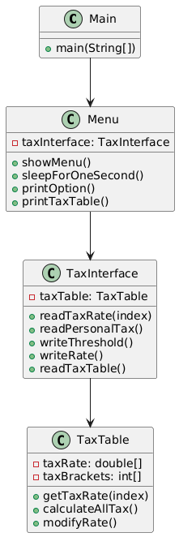

## TaxCalculator 设计文档

Author: 陈柏林

Email: chenblin23@mail2.sysu.edu.cn

GitHub Repository: https://github.com/Jonacbl/TaxCalculator

### **简介**

**项目名称**：TaxCalculator
**项目描述**：TaxCalculator 是一个基于 Java 的命令行程序，用于计算个人所得税、查看和修改税率表。

### **特性**

- **操作系统**：Windows 11 

- **开发语言**：Java
- **开发环境**：IntelliJ IDEA Ultimate 2024.3.4 & Oracle OpenJDK 23.0.2
- **命令行支持**：程序可在命令行运行，用户可以输入选项选择功能。
- **Javadoc 支持**：项目使用 Javadoc 生成文档，并提供 `docmake.bat` 脚本自动生成文档。
- **脚本支持**：提供 `run.bat` 以便于快速运行项目。

### **项目结构**

```
TaxCalculator/                  // 根目录
|---- bin/                      // 存放编译生成的中间文件（.class 文件）
|---- docs/                     // 存放 Javadoc 生成的说明性文档
|---- src/                      // 存放源代码文件
|   |---- utils/                // 工具类包
|   |---- Menu.java             // 菜单类
|   |---- TaxInterface.java     // 税务接口
|---- Main.java                 // 项目入口文件
|---- docmake.bat               // 生成文档的批处理脚本
|---- run.bat                   // 运行项目的批处理脚本
```

## **系统设计**

### **类关系**

本项目采用面向对象设计，主要包括以下三个类：

1. `Main` (主程序入口)
2. `Menu` (菜单管理)
3. `TaxInterface` (税务计算与管理)

### **类图**

```
+------------------+
|      Main        |
+------------------+
| - main(String[]) |
+------------------+
        |
        v
+------------------+
|      Menu        |
+------------------+
| - taxint: TaxInterface |
| - showMenu()          |
| - sleepForOneSecond() |
+------------------+
        |
        v
+-------------------------+
|      TaxInterface       |
+-------------------------+
| - threshold: int        |
| - taxRate: double[]     |
| - taxBrackets: int[]    |
| - getTaxRate(index)     |
| - getThreshold()        |
| - calculatePersonalTax()|
| - modifyThreshold()     |
| - modifyRate()          |
| - printTaxTable()       |
+-------------------------+
```

使用`IntelliJ IDEA` 生成的`UML`类图如下：




## **详细设计**

### **Main 类**

- **职责**：
  - 作为项目的启动入口。
  - 调用 `Menu` 进行菜单显示和交互。
- **主要方法**：
  - `main(String[] args)`: 创建 `Menu` 对象并调用 `showMenu()` 方法。

### **Menu 类**

- **职责**：
  - 处理用户输入，调用 `TaxInterface` 提供的功能。
  - 负责菜单交互，包括计算税收、修改税率等。
- **主要方法**：
  - `showMenu()`: 显示菜单并处理用户输入。
  - `sleepForOneSecond()`: 让程序暂停 1 秒，以提升用户体验。

### **TaxInterface 类**

- **职责**：
  - 计算个人所得税，并提供修改税率和起征点的功能。
  - 存储税率表和税级信息。
- **主要方法**：
  - `calculatePersonalTax(int salary)`: 计算个人所得税。
  - `modifyThreshold(int newThreshold)`: 修改起征点。
  - `modifyRate(int index, double rate)`: 修改指定税级的税率。
  - `printTaxTable()`: 打印税率表。


## **运行方式**

### **运行程序**

在命令行中运行：

```bat
run.bat
```

### **生成 Javadoc**

```bat
docmake.bat
```


## **扩展功能**

未来可以扩展以下功能：

- **支持 GUI 界面**：通过 JavaFX 或 Swing 实现可视化界面。
- **持久化存储**：使用 JSON、数据库等存储用户修改的税率。
- **更多税种计算**：如增值税、企业税等。